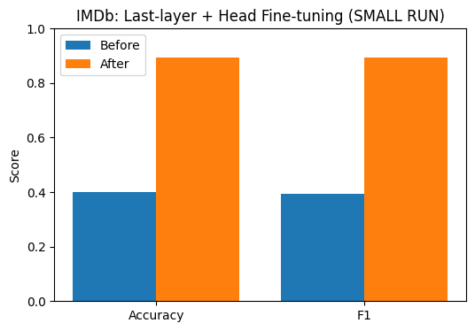
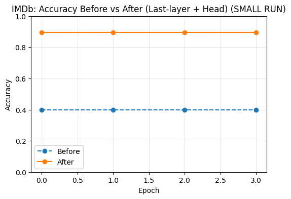

Last-layer + Head Fine-tuning (IMDb Sentiment Analysis)
This project demonstrates last-layer fine-tuning of a pretrained Transformer (DistilBERT) on the IMDb movie review dataset.
Unlike head-only fine-tuning, here we:
•	Freeze the entire backbone.
•	Unfreeze only the last Transformer block + the new classification head.
•	Train these components, allowing slight adaptation of the backbone while keeping compute manageable.
________________________________________
📌 Project Overview
•	Model: distilbert-base-uncased
•	Dataset: IMDb reviews → binary classification (positive / negative)
•	Method:
1.	Load pretrained DistilBERT.
2.	Freeze all parameters.
3.	Unfreeze the last Transformer layer and classification head.
4.	Fine-tune on IMDb reviews.
________________________________________
⚡ Features
•	Efficient adaptation with limited compute.
•	Demonstrates a trade-off between full fine-tuning and head-only training.
•	Clear performance jump shown with before vs after plots.
•	Supports SMALL_RUN mode for Colab demo (4k train / 2k test).
________________________________________
🛠️ Setup
pip install transformers datasets evaluate accelerate
________________________________________
🚀 Training Workflow
1. Baseline
•	Evaluate the model with frozen backbone and a random head.
•	Accuracy ~50% (chance level).
2. Fine-tuning
•	Train head + last Transformer layer for 3 epochs.
•	Small learning rate (2e-5) to avoid catastrophic forgetting.
3. Evaluation
•	Significant improvement in Accuracy and F1 score.
________________________________________
## 📊 Results

### Bar Chart – Accuracy & F1

### Line Chart – Accuracy Across Epochs

________________________________________
🔮 Inference Demo
After training, you can run quick predictions:
predict([
    "This movie was absolutely wonderful. The performances were touching.",
    "Boring plot and terrible acting. I want my time back."
])
Example Output:
[
  {"text": "...wonderful...", "neg_prob": 0.01, "pos_prob": 0.99, "label": "pos"},
  {"text": "...terrible...",  "neg_prob": 0.97, "pos_prob": 0.03, "label": "neg"}
]
________________________________________
📂 Project Structure
last_layer_fine_tuning.py        # training script (exported from Colab)
outputs/
   imdb_last_layer/model/         # saved fine-tuned model + tokenizer
images/
   bar_chart.png                  # Before vs After (Accuracy & F1)
   Line_chart.png                 # Accuracy Before vs After across epochs
________________________________________
👤 Author
Shubham Singh
________________________________________
📜 License
MIT License
