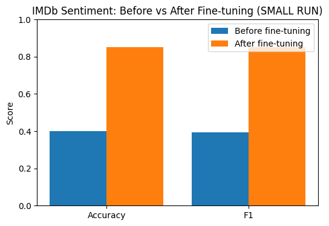
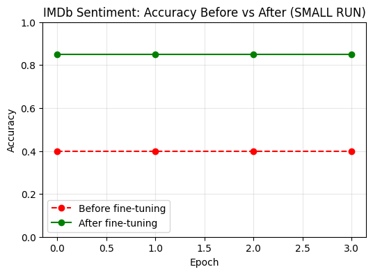

Fine-Tuning Transformers with a New Head (IMDb Sentiment Analysis)
This project demonstrates head-only fine-tuning of a pretrained Transformer (DistilBERT) on the IMDb movie review dataset.
Instead of retraining or unfreezing the entire model, we freeze the backbone and train only a fresh classification head. This is a lightweight, efficient way to adapt large models to specific tasks.
________________________________________
📌 Project Overview
•	Model: distilbert-base-uncased
•	Dataset: IMDb reviews → binary sentiment classification (positive / negative)
•	Method:
1.	Load pretrained DistilBERT.
2.	Freeze all backbone parameters.
3.	Attach a new linear classification head (automatically created by AutoModelForSequenceClassification).
4.	Train only this head on IMDb labeled data.
________________________________________
⚡ Features
•	Runs quickly on Google Colab with a free Tesla T4 GPU.
•	Supports a SMALL_RUN mode for demo/testing (4k train / 2k test samples).
•	Visualizes before vs after fine-tuning with bar and line charts.
•	Saves the fine-tuned model for later inference.
________________________________________
🛠️ Setup
pip install transformers datasets evaluate accelerate
________________________________________
🚀 Training Workflow
1. Baseline (before training)
We evaluate the model with a randomly initialized head (backbone frozen).
Accuracy is close to chance (~50%).
2. Fine-tuning
We train the head for 3 epochs on IMDb.
•	Optimizer updates only the new head parameters.
•	Backbone remains frozen.
3. Evaluation (after training)
We evaluate again and observe a significant jump in performance.
________________________________________
## 📊 Results

### Bar Chart – Accuracy & F1

### Line Chart – Accuracy Across Epochs

________________________________________
🔮 Inference Demo
After fine-tuning, you can run quick predictions:
predict([
    "This movie was absolutely wonderful. The performances were touching.",
    "Boring plot and terrible acting. I want my time back."
])
Example Output:
[
  {"text": "...wonderful...", "neg_prob": 0.01, "pos_prob": 0.99, "label": "pos"},
  {"text": "...terrible...",  "neg_prob": 0.98, "pos_prob": 0.02, "label": "neg"}
]
________________________________________
📂 Project Structure
fine_tunning_new_head_addiiton.py   # main training script
outputs/
   imdb_head_only/model/            # saved fine-tuned model + tokenizer
images/
   BAR_CHART.png                    # Before vs After (Accuracy & F1)
   LINE_CHART.png                   # Accuracy Before vs After across epochs
________________________________________
👤 Author
Shubham Singh
________________________________________
📜 License
MIT License
