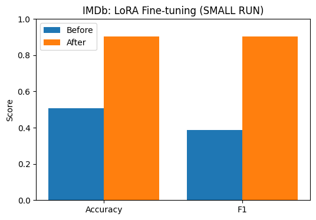
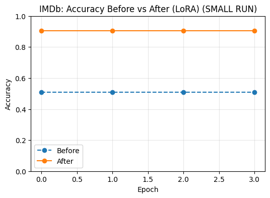

LoRA Fine-tuning with PEFT (IMDb Sentiment Analysis)
This project demonstrates Parameter-Efficient Fine-Tuning (PEFT) using LoRA (Low-Rank Adaptation) on the IMDb movie review dataset.
Instead of updating the full 110M parameters of BERT, LoRA injects tiny trainable adapters into the attention projections (query & value) while freezing the backbone. This reduces compute/memory while achieving strong accuracy.
________________________________________
📌 Project Overview
•	Model: bert-base-uncased
•	Dataset: IMDb reviews → sentiment classification (positive / negative)
•	Method:
1.	Load pretrained BERT.
2.	Freeze backbone parameters.
3.	Insert LoRA adapters into query (Wq) and value (Wv) matrices of each attention layer.
4.	Train only LoRA adapters + classifier head.
________________________________________
⚡ Features
•	Efficient fine-tuning with only ~1% of parameters trained.
•	Supports SMALL_RUN mode for quick Colab demos (4k train / 2k test).
•	Plots before vs after accuracy & F1.
•	Saves fine-tuned model for reuse.
________________________________________
🛠️ Setup
pip install transformers datasets evaluate accelerate peft bitsandbytes
________________________________________
🚀 Training Workflow
1. Baseline
•	Evaluate model with frozen backbone + untrained LoRA adapters.
•	Accuracy near chance (~50%).
2. Fine-tuning
•	Train adapters (rank = 8, alpha = 16, dropout = 0.1).
•	Use higher learning rate (2e-4) since only small matrices are trained.
3. Evaluation
•	Accuracy & F1 jump significantly after fine-tuning.
________________________________________
## 📊 Results

### Bar Chart – Accuracy & F1

### Line Chart – Accuracy Across Epochs

________________________________________
🔮 Inference Demo
After training, run quick predictions:
predict([
    "This movie was absolutely wonderful. The performances were touching.",
    "Boring plot and terrible acting. I want my time back."
])
Example Output:
[
  {"text": "...wonderful...", "neg_prob": 0.01, "pos_prob": 0.99, "label": "pos"},
  {"text": "...terrible...",  "neg_prob": 0.98, "pos_prob": 0.02, "label": "neg"}
]
________________________________________
📂 Project Structure
peft_lora.py                       # training script (exported from Colab)
outputs/
   imdb_lora/model/                # saved fine-tuned model + tokenizer
images/
   bar_chart.png                   # Before vs After (Accuracy & F1)
   line_chart.png                  # Accuracy Before vs After across epochs
________________________________________
👤 Author
Shubham Singh
________________________________________
📜 License
MIT License
