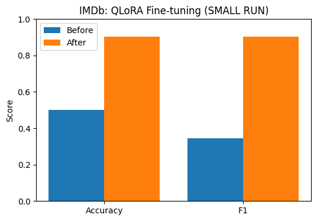
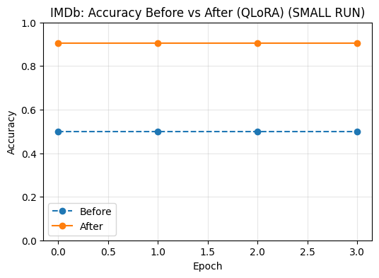

QLoRA Fine-tuning with PEFT (IMDb Sentiment Analysis)
This project demonstrates QLoRA (Quantized LoRA), a Parameter-Efficient Fine-Tuning (PEFT) method, applied on the IMDb movie review dataset.
QLoRA combines 4-bit quantization (via bitsandbytes) with LoRA adapters to drastically reduce memory while maintaining strong accuracy. This enables fine-tuning even large language models (LLMs) on a single GPU like Colab T4.
________________________________________
📌 Project Overview
•	Model: bert-base-uncased
•	Dataset: IMDb reviews → sentiment classification (positive / negative)
•	Method:
1.	Load model in 4-bit quantized mode using bitsandbytes.
2.	Freeze backbone parameters.
3.	Insert LoRA adapters into query (Wq) and value (Wv) matrices of each attention layer.
4.	Train only LoRA adapters + classifier head.
________________________________________
⚡ Features
•	Memory efficient: 4-bit quantization shrinks model size by ~75%.
•	Parameter-efficient: Only ~1% of weights trained.
•	Supports Colab T4 GPUs (through bf16, no fp16 gradient issues).
•	Plots before vs after accuracy & F1.
•	Saves fine-tuned model for reuse.
________________________________________
🛠️ Setup
pip install -U bitsandbytes
pip install -U transformers accelerate peft datasets evaluate
________________________________________
🚀 Training Workflow
1. Baseline
•	Model loaded in 4-bit, LoRA adapters untrained.
•	Accuracy near random (~50%).
2. QLoRA Fine-tuning
•	Train adapters (rank = 8, alpha = 16, dropout = 0.1).
•	Backbone stays frozen.
•	Training done in bf16 precision for stability.
3. Evaluation
•	Accuracy & F1 improve significantly after fine-tuning.
________________________________________
## 📊 Results

### Bar Chart – Accuracy & F1

### Line Chart – Accuracy Across Epochs

________________________________________
🔮 Inference Demo
After training, run quick predictions:
predict([
    "This movie was absolutely wonderful. The performances were touching.",
    "Boring plot and terrible acting. I want my time back."
])
Example Output:
[
  {"text": "...wonderful...", "neg_prob": 0.01, "pos_prob": 0.99, "label": "pos"},
  {"text": "...terrible...",  "neg_prob": 0.98, "pos_prob": 0.02, "label": "neg"}
]
________________________________________
📂 Project Structure
peft_qlora.py                       # training script (exported from Colab)
outputs/
   imdb_qlora/model/                # saved fine-tuned model + tokenizer
images/
   bar_chart.png                    # Before vs After (Accuracy & F1)
   line_chart.png                   # Accuracy Before vs After across epochs
________________________________________
👤 Author
Shubham Singh
________________________________________
📜 License
MIT License
