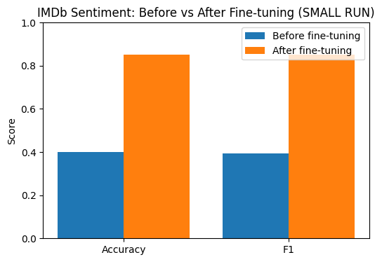
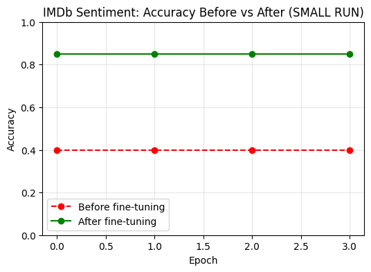
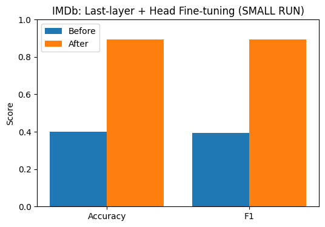
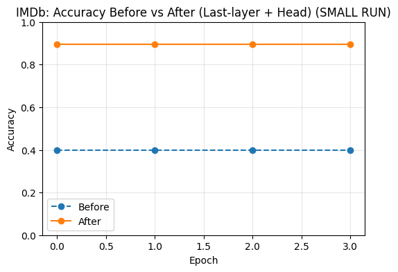
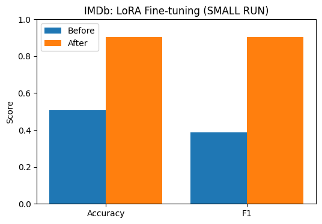
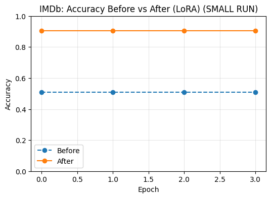
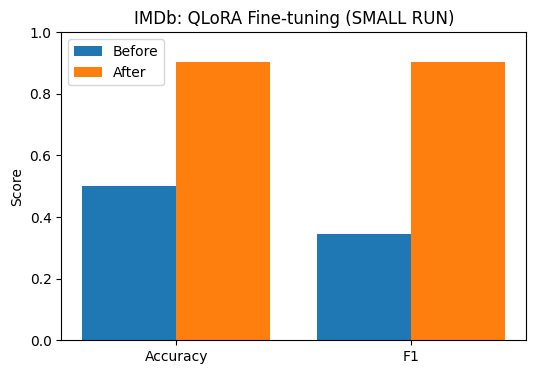
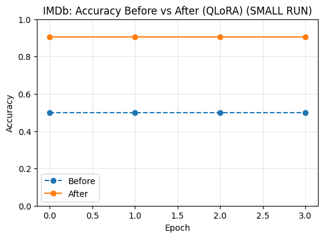

# FINE_TUNING
A complete showcase of modern Transformer fine-tuning strategies — from full fine-tuning to parameter-efficient PEFT

Transformer Fine-Tuning Experiments (Head-only, Last-layer, LoRA, QLoRA)

This repository is a comprehensive showcase of fine-tuning strategies for Transformers, applied to the IMDb Sentiment Classification
 task.

It explores traditional fine-tuning (head-only, last-layer) alongside parameter-efficient fine-tuning (PEFT) methods (LoRA and QLoRA).

📌 Project Structure
FINE_TUNING/
│
├── NEW_HEAD/       # Head-only fine-tuning
├── LAST_LAYER/     # Last-layer + head fine-tuning
├── PEFT_LORA/      # LoRA fine-tuning (PEFT)
├── PEFT_QLORA/     # QLoRA fine-tuning (PEFT + 4-bit quantization)
│
├── LICENSE
└── README.md       # (this file)

Each subfolder contains:

Training script (.py)

Results (bar chart + line chart)

README.md explaining the method + results

🔹 Methods Implemented
1️⃣ Head-only Fine-tuning (NEW_HEAD)

Freeze the pretrained model.

Train only a new classification head.

Fast, lightweight, but limited adaptation.

## 📊 Results

### Bar Chart – Accuracy & F1

### Line Chart – Accuracy Across Epochs

2️⃣ Last-layer Fine-tuning (LAST_LAYER)

Train the classification head and the last Transformer block.

Balances compute and performance.

## 📊 Results

### Bar Chart – Accuracy & F1

### Line Chart – Accuracy Across Epochs

3️⃣ LoRA Fine-tuning (PEFT_LORA)

Insert low-rank adapters into Query & Value projection matrices.

Train only adapters + head, freeze backbone.

Efficient, memory-friendly, strong performance.

## 📊 Results

### Bar Chart – Accuracy & F1

### Line Chart – Accuracy Across Epochs

4️⃣ QLoRA Fine-tuning (PEFT_QLORA)

Load backbone in 4-bit NF4 quantized mode (bitsandbytes).

Add LoRA adapters for efficient fine-tuning.

Enables training larger models on a single GPU.

## 📊 Results

### Bar Chart – Accuracy & F1

### Line Chart – Accuracy Across Epochs

⚡ Parameter Efficiency Comparison
Method	Trainable Params	GPU Memory	Accuracy Gain
Head-only	~1–2%	Low	✅ Limited
Last-layer	~10–15%	Medium	✅ Good
LoRA (PEFT)	~1%	Low	✅ Strong
QLoRA (PEFT + 4b)	~1%	Ultra-Low	✅ Strong
🛠️ Setup
pip install -U transformers datasets evaluate accelerate peft bitsandbytes

👤 Author

Shubham Singh

📜 License

MIT License
